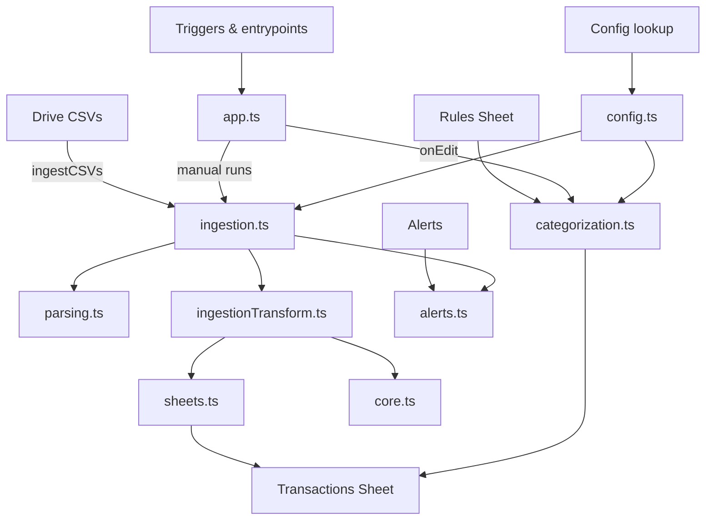

# Transactions ETL for Google Sheets (Apps Script + TypeScript)

This project provides a spreadsheet-native ETL for ingesting bank CSV exports into a single Google Sheet, deduplicating and normalizing transactions, and applying rule-based categorization.

## Features

- **CSV ingestion** from a Google Drive folder with header-hash based mapping.
- **Normalization** of dates and money values with per-source configuration.
- **Deterministic deduplication** using a composite key.
- **Rules-based categorization** managed in a `Rules` sheet.
- **Alerting** via email when ingestion fails or an unknown CSV header is detected.

## Project layout

- `src/` – TypeScript source for Apps Script.
- `tests/` – Jest tests for pure helper utilities.
- `dist/` – Compiled Apps Script (generated).

## Architecture



## Setup

1. Install dependencies:
   ```bash
   npm install
   ```
2. Configure your Apps Script project (using `clasp`):
   ```bash
   npx clasp login
   npx clasp create --type sheets --title "Transactions ETL"
   ```
3. Copy the generated `.clasp.json` into the repository root (it is gitignored).
4. Configure script properties in Apps Script:
   - `RAW_FOLDER_ID` (required)
   - `ARCHIVE_FOLDER_ID` (optional)
   - `ALERT_EMAIL` (optional)
5. Update `CONFIGS_BY_HEADER_HASH` in `src/config.ts` for each CSV header layout you want to support.

## Build & deploy

```bash
npm run build
npm run push
```

## Running the workflow

- **Ingestion**: run `ingestCSVs` (time-driven trigger recommended).
- **Categorization**: run `applyCategorization` or rely on `onEdit` triggers.

## Sheets expected

Run `npm run docs:readme` to refresh the lists below from `src/config.ts`.

<!-- CONFIG_HEADERS_START -->
### Transactions sheet headers

- `Account Name`
- `Institution`
- `Date`
- `Type`
- `Description`
- `Withdrawal`
- `Deposit`
- `Check Number`
- `Category`
- `Source File`
- `Manual Category`
- `Category by Rule`
- `Matched Rule ID`

### Rules sheet headers

- `Rule ID`
- `ON`
- `Category`
- `Description Regex`
- `Account Regex`
- `Type Regex`
- `Min Amount`
- `Max Amount`
<!-- CONFIG_HEADERS_END -->

## Notes

- Unknown CSV headers will halt ingestion for that file and trigger an email alert.
- Categorization writes to `Category by Rule` and `Matched Rule ID` without overwriting manual categories.
